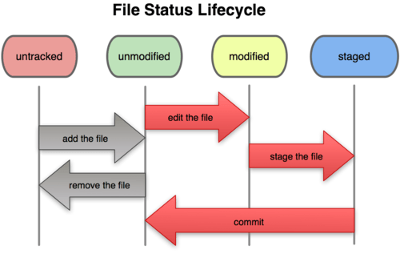

# Estado dos arquivos no Git



| Estado | Descrição |
|-------------|------------------------------------------------------------------------|
| Untracked | É o arquivo criado, mas não rastreado pelo git (não passou pelo git add).|
| Unmodified | É o arquivo que passou pelo git add e commit, mas que após isso não foi modificado.|
| Modified | É o arquivo que já havia passado pelo commit e sofreu uma alteração.|
| Staged | É o arquivo que passou pelo git add e está pronto para o commit.|

# Comandos Git para windows no prompt:

### Baixa o Git na máquina ou atualizar:
```winget install --id Git.Git -e --source winget```


## - Configurando o Git:

### Cria o nome:
```git config -–global user.name <nome>```
### Coloca o e-mail:
```git config -–global user.email <email>```
### Verifica lista de configurações do Git:
```git config --list```
### Retorna a versão do Git se estiver instalado:
```git --version```

## - Principais comandos do Git:

### Cria um repositório local:
```git init```
### Clona um repositório remoto para o local:
```git clone <URL>```
### Prepara o arquivo (staging area) para o commit:
```git add .``` ou  
```git add .\<nome_arquivo>```
### Envia o arquivo (staged) para o repositório local:
```git commit -m <mensagem>```
### Exibe o estado atual do repositório:
```git status```
### Mostra o histórico de commits:
```git log```
### Mostra em que branch estamos e os commits:
```git log --oneline --decorate```
### Lista todas as branchs locais e destaca a atual:
```git branch```
### Cria uma branch:
```git branch <nome_branch>```
### Altera para uma branch específica:
```git checkout <nome_branch>```
### Combina as alterações de uma branch com a atual:
```git merge <nome_branch>```
### Deleta uma branch local:
```git branch <nome_branch> -D```
### Deleta uma branch remota:
```git push origin --delete <nome_branch_remota>``` 
### Atualiza repositório local com o remoto (com um merge):
```git pull```
### Recupera as últimas alterações do repositório remoto (sem merge automático), permitindo ver as diferenças entre o repositório remoto e o local antes de alterar o local:
```git fetch``` após isso, usa o diff <br>
```git diff <nome_repositório> <nome_branch>``` se quiser modificar, pode fazer um git pull.
### Envia os commits para o repositório remoto:
```git push <nome_repositório_remoto> <nome_branch>```
### Lista os repositórios remotos configurados:
```git remote -v```
### Desfaz alterações de arquivo específico, removendo do índice:
```git reset <nome_arquivo>```
### Remove arquivo de um repositório e inclui no próximo commit:
```git rm <nome_arquivo>```
### Remove alterações do arquivo:
```git restore <nome_arquivo>```
### Remove o arquivo da área de staging:
```git restore --staged <nome_arquivo>```
### Mostra as diferenças entre as alterações ainda não adicionadas nos índices:
```git diff```
### Mostra as diferenças entre as alterações do arquivos na área de staging:
```git diff --staged```
### Adiciona repositório remoto com um nome específico no repositório local:
```git remote add <nome_repositório_remoto> <URL>```
### Envia alterações locais para o repositório remoto:
```git push add origin main```


